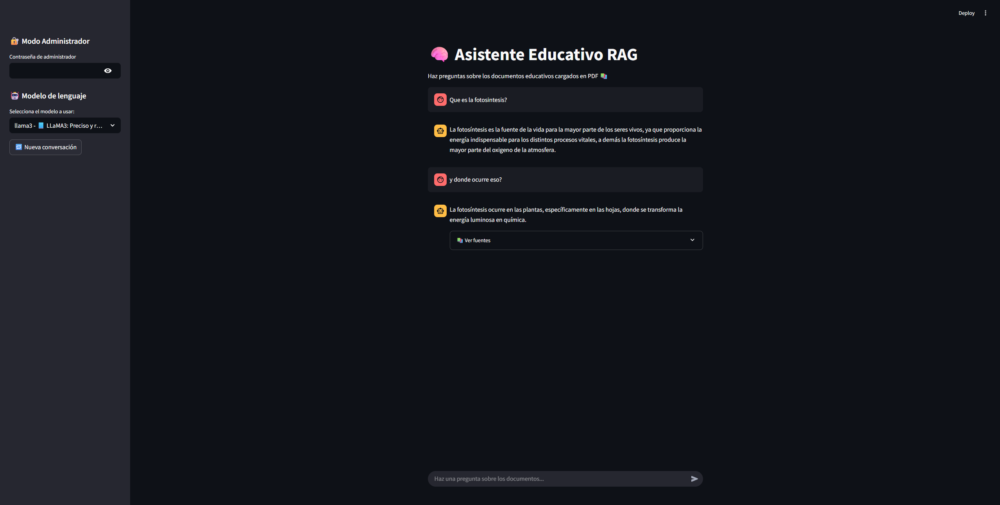

# 🧠 Asistente Educativo RAG

Este es un proyecto completo de aplicación de **RAG (Retrieval-Augmented Generation)** utilizando **PDFs educativos** como fuente de conocimiento, con capacidad de **conversación contextual**, **subida de nuevos documentos**, selección de **modelos LLM** desde **Ollama**, y una interfaz profesional desarrollada con **Streamlit**.

---

## 🎯 Objetivo del proyecto

Desarrollar una aplicación inteligente que permita:
- Consultar documentos PDF educativos (por ejemplo, sobre fotosíntesis).
- Recuperar información relevante mediante bases vectoriales (**ChromaDB**).
- Generar respuestas contextualizadas usando modelos como `llama3`, `mistral`, `deepseek-r1` desde **Ollama**.
- Interactuar mediante una interfaz conversacional, con capacidad de recordar el contexto.

---

## 🧰 Tecnologías utilizadas

| Componente        | Descripción                                       |
|------------------|---------------------------------------------------|
| `LangChain`      | Orquestación de cadenas y manejo de memoria       |
| `Ollama`         | Modelos LLM locales como `llama3`, `mistral`      |
| `ChromaDB`       | Base vectorial para almacenar embeddings          |
| `Streamlit`      | Interfaz gráfica para interacción con el usuario  |
| `nomic-embed-text` | Modelo de embeddings ejecutado en Ollama        |

---

## ⚙️ Funcionalidades principales

- ✅ Consulta y conversación con contexto real (memoria integrada).
- ✅ Visualización de fuentes utilizadas en cada respuesta.
- ✅ Interfaz moderna con animación palabra por palabra.
- ✅ Selector de modelo LLM en tiempo real desde el sidebar.
- ✅ Subida de nuevos documentos PDF desde la app (*modo admin*).
- ✅ Limpieza de la base vectorial desde el panel admin.
- ✅ Modo seguro con autenticación de administrador (`educa123`).

---

## 🚀 ¿Cómo ejecutar el proyecto?

### 1. Clonar el repositorio

```bash
git clone https://github.com/jonathanrji/asistente-educativo-rag.git
cd asistente-educativo-rag
```

### 2. Crear entorno virtual con `uv`

```bash
uv venv
uv pip install -r requirements.txt
```

### 3. Ejecutar Ollama y cargar modelos

```bash
ollama run llama3
ollama pull nomic-embed-text
```

### 4. Cargar documentos PDF en `/data/` o usar la app como administrador para subirlos.

### 5. Ejecutar la app

```bash
streamlit run app.py
```

---

## 📂 Estructura del proyecto

```
proyecto-rag-educativo/
├── app.py
├── data/                 ← PDFs cargados
├── chroma_db/            ← Base vectorial generada
├── src/
│   ├── ingest.py         ← Procesamiento y almacenamiento de PDFs
│   ├── qa_chain.py       ← Lógica de RAG con memoria conversacional
│   ├── utils.py          ← Funciones auxiliares
├── README.md
└── requirements.txt
```

---

## 🧠 Créditos y agradecimientos

Jonathan Rojas Ibáñez
Carlos Rodríguez

---

## 📸 Captura (ejemplo)



---

## 🔐 Contraseña de administrador

```text
educa123
```

---

## 💬 ¿Preguntas sugeridas para probar la app?

- ¿Qué es la fotosíntesis?
- ¿Dónde ocurre la fotosíntesis?
- ¿Qué elementos necesita la planta?
- ¿Qué productos genera este proceso?